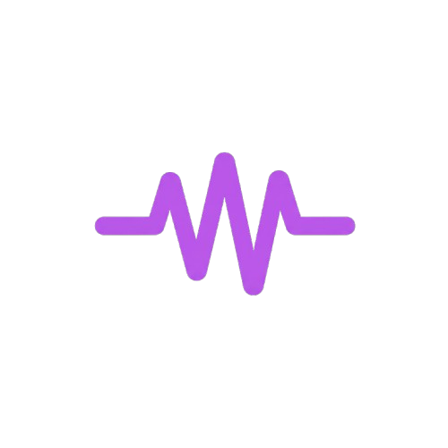

# 🎵 Soundwave Music Player

> A modern, cross-platform music player application built with React, TypeScript, and Capacitor. Stream, manage, and enjoy your music library across web, desktop, and mobile devices.

**Version:** 1.5.0  
**Repository:** [lonewolffsd/soundwave](https://github.com/lonewolffsd/soundwave)

<div align="center">
  
</div>

---

## 🌟 Overview

Soundwave Music is a feature-rich music player designed for seamless cross-platform music playback and library management. Built with modern technologies, it provides an intuitive interface for discovering, organizing, and enjoying music on web browsers, desktop applications (Electron), and Android devices (Capacitor).

The application integrates with Firebase for authentication, storage, and real-time synchronization, ensuring your music library is always accessible wherever you are.

---

## ✨ Key Features

### 🎶 Audio Playback
- **Multi-format support**: MP3, WAV, FLAC, and more
- **Advanced playback controls**: Play, pause, stop, seek, volume control
- **Shuffle & repeat modes**: Full playback customization
- **Audio visualization**: Real-time waveform and spectrum analyzers
- **Quality streaming**: Adaptive bitrate selection

### 📚 Library Management
- **Song organization**: Browse and search music library
- **Playlist creation**: Create, edit, and manage custom playlists
- **Playlist sharing**: Share playlists with other users
- **Cloud sync**: Synchronize library across all devices
- **Bulk upload**: Upload multiple songs at once

### 🔐 Authentication & Security
- **Firebase Authentication**: Google Sign-in support
- **User profiles**: Personalized user accounts
- **OAuth 2.0 integration**: Secure third-party authentication
- **Session management**: Automatic session handling

### 🎨 User Experience
- **Responsive design**: Fully responsive UI for all screen sizes
- **Dark/Light theme**: Switchable theme support
- **Accessibility**: WCAG-compliant interface
- **Mobile optimized**: Touch-friendly controls
- **Smooth animations**: Polished UI transitions

### 🔊 Advanced Features
- **Speech recognition**: Voice command support (AssemblyAI integration)
- **Sound Assistant**: AI-powered music recommendations
- **Soundie Explorer**: Discover new music
- **Native notifications**: Push notifications for events
- **Download management**: Offline music downloads
- **Screen brightness**: Auto-brightness control

### 📱 Cross-Platform Support
- **Web**: Full browser support
- **Desktop**: Electron-powered desktop application
- **Mobile**: Android app via Capacitor
- **Cloud deployment**: Vercel hosting

<div align="center">
  
  <p><em>Soundwave runs seamlessly across all your devices</em></p>
</div>

---

## 🛠️ Technology Stack

### Frontend
| Technology | Purpose |
|-----------|---------|
| **React** | UI framework |
| **TypeScript** | Type-safe development |
| **Vite** | Fast build tool & dev server |
| **Tailwind CSS** | Utility-first styling |
| **shadcn/ui** | Pre-built component library |
| **React Hook Form** | Form state management |
| **Zod** | Schema validation |
| **Sonner** | Toast notifications |

### Backend & Services
| Technology | Purpose |
|-----------|---------|
| **Node.js** | Server runtime |
| **Express.js** | Backend framework |
| **Firebase** | Authentication, database, hosting |
| **Firebase Admin SDK** | Server-side Firebase operations |
| **AssemblyAI API** | Speech recognition |

### Cross-Platform
| Technology | Purpose |
|-----------|---------|
| **Electron** | Desktop application framework |
| **Capacitor** | Native mobile bridge |
| **Android SDK** | Android build support |

### DevOps & Deployment
| Technology | Purpose |
|-----------|---------|
| **Vercel** | Web hosting & deployment |
| **Git** | Version control |
| **pnpm** | Package manager |
| **Electron Builder** | Desktop app packaging |

### Capacitor Plugins
- `@capacitor/native-audio` - Native audio playback
- `@capacitor/screen-brightness` - Screen control
- `@capacitor-community/speech-recognition` - Voice input
- `@capacitor-firebase/authentication` - Mobile auth
- `@capgo/capacitor-media-session` - Media controls

<div align="center">
  
</div>

---

## 📋 Prerequisites

### Required
- **Node.js** >= 16.x (v18+ recommended)
- **npm** >= 8.x or **pnpm** >= 7.x
- **Git** for version control

### For Desktop Development (Electron)
- Windows/macOS/Linux with build tools
- Visual C++ Build Tools (Windows)
- Xcode Command Line Tools (macOS)

### For Mobile Development (Android)
- Android SDK (API Level 31+)
- Java Development Kit (JDK) 11+
- Android Studio (optional but recommended)
- Gradle

### For Firebase
- Firebase project created at [Firebase Console](https://console.firebase.google.com)
- Firebase credentials configured

---

## 🚀 Installation & Setup

### 1. Clone the Repository
```bash
git clone https://github.com/lonewolffsd/soundwave.git
cd "Music Player"
```

### 2. Install Dependencies
```bash
# Using pnpm (recommended)
pnpm install

# Or using npm
npm install
```

### 3. Configure Environment Variables
```bash
cp .env.example .env.local
```

Edit `.env.local` and add your Firebase credentials:
```env
VITE_FIREBASE_API_KEY=your_api_key
VITE_FIREBASE_AUTH_DOMAIN=your_auth_domain
VITE_FIREBASE_PROJECT_ID=your_project_id
VITE_FIREBASE_STORAGE_BUCKET=your_storage_bucket
VITE_FIREBASE_MESSAGING_SENDER_ID=your_sender_id
VITE_FIREBASE_APP_ID=your_app_id

# AssemblyAI API Key
VITE_ASSEMBLYAI_API_KEY=your_assemblyai_key

# Server Configuration
REACT_APP_API_URL=http://localhost:3000
```

### 4. Set Up Firebase
Follow the guide in [docs/FIREBASE_SETUP.md](docs/FIREBASE_SETUP.md) to:
- Create a Firebase project
- Enable authentication methods
- Set up Firestore database
- Configure storage bucket
- Generate service account credentials

---

## 💻 Development Guide

### Web Development
```bash
# Start development server (http://localhost:5173)
pnpm run dev

# Build for production
pnpm run build

# Preview production build
pnpm run preview
```

### Desktop Development (Electron)
```bash
# Run Electron development environment
pnpm run electron:dev

# Build Electron application
pnpm run electron:build
```

### Backend Server
```bash
# Start Node.js server (http://localhost:3000)
pnpm run server

# Server runs on port 3000 by default
```

### Mobile Development (Android)
```bash
# Sync Capacitor files
npx cap sync

# Open Android Studio
npx cap open android

# Build APK
./gradlew assembleDebug

# Run on emulator/device
npx cap run android
```

### Debugging
- **Browser DevTools**: F12 in web/Electron
- **Android Logcat**: `adb logcat` for mobile
- **Firebase Console**: Monitor logs and errors

---

## 📂 Project Structure

```
Music Player/
├── src/                          # React application source
│   ├── main.tsx                  # React entry point
│   ├── App.tsx                   # Main application component
│   ├── components/               # Feature-specific React components
│   │   ├── Player.tsx            # Audio player controls
│   │   ├── SongList.tsx          # Song list display
│   │   ├── Sidebar.tsx           # Navigation sidebar
│   │   ├── PlaylistManager.tsx   # Playlist management
│   │   ├── Visualizer.tsx        # Audio visualization
│   │   ├── SoundieExplorer.tsx   # Music discovery
│   │   └── ...                   # Other components
│   ├── context/                  # React Context state
│   │   ├── AuthContext.tsx       # Authentication state
│   │   └── PlayerContext.tsx     # Player state management
│   ├── api/                      # API integration
│   │   ├── sync.js               # Library sync endpoint
│   │   └── deleteSong.js         # Song deletion endpoint
│   ├── utils/                    # Utility functions
│   │   ├── firebase.ts           # Firebase configuration
│   │   ├── api.ts                # API client
│   │   ├── constants.ts          # App constants
│   │   └── themeHelper.ts        # Theme utilities
│   ├── pages/                    # Page components
│   └── styles/                   # Global styles
│
├── components/                   # UI component library (shadcn/ui)
│   ├── ui/                       # 58+ reusable UI components
│   │   ├── button.tsx
│   │   ├── card.tsx
│   │   ├── dialog.tsx
│   │   └── ...
│   └── theme-provider.tsx        # Theme wrapper
│
├── app/                          # Next.js app layer
│   ├── layout.tsx                # Root layout
│   ├── page.tsx                  # Home page
│   └── globals.css               # Global styles
│
├── server/                       # Node.js backend
│   ├── index.js                  # Express server
│   ├── handlers.js               # Route handlers
│   ├── firebaseAdmin.js          # Firebase admin setup
│   └── package.json              # Server dependencies
│
├── android/                      # Android native code
│   ├── app/                      # Android app module
│   ├── gradle/                   # Gradle build configuration
│   └── settings.gradle           # Gradle settings
│
├── public/                       # Static public assets
│   └── sitemap.xml               # SEO sitemap
│
├── docs/                         # Documentation
│   ├── FIREBASE_SETUP.md         # Firebase configuration guide
│   ├── DEPLOYMENT.md             # Deployment instructions
│   └── GETTING_STARTED.md        # Quick start guide
│
├── assets/                       # Images, icons, audio samples
├── styles/                       # Global stylesheets
├── hooks/                        # Custom React hooks
├── lib/                          # Shared libraries
│
├── Configuration Files
│   ├── vite.config.ts            # Vite build configuration
│   ├── tsconfig.json             # TypeScript configuration
│   ├── tailwind.config.js        # Tailwind CSS config
│   ├── capacitor.config.ts       # Capacitor configuration
│   ├── electron.js               # Electron entry point
│   ├── next.config.mjs           # Next.js configuration
│   ├── vercel.json               # Vercel deployment config
│   └── package.json              # Project dependencies
│
└── Environment
    ├── .env.example              # Example environment variables
    ├── .gitignore                # Git ignore patterns
    └── .git/                     # Git repository
```

---

## 🔗 API Endpoints

### Backend Server (localhost:3000)

#### Song Management
```
POST   /api/songs/upload          Upload a new song
GET    /api/songs                 Get all songs
GET    /api/songs/:id             Get song details
DELETE /api/songs/:id             Delete a song
POST   /api/songs/sync            Sync library across devices
```

#### Playlist Management
```
POST   /api/playlists             Create playlist
GET    /api/playlists             Get user playlists
PUT    /api/playlists/:id         Update playlist
DELETE /api/playlists/:id         Delete playlist
POST   /api/playlists/:id/songs   Add song to playlist
```

#### User Management
```
GET    /api/user/profile          Get user profile
PUT    /api/user/profile          Update profile
POST   /api/user/settings         Save user settings
```

---

## 🎯 Usage Guide

### Web Player
1. **Sign In**: Click "Sign in with Google" to authenticate
2. **Upload Music**: Click "Upload Songs" to add music to library
3. **Browse Library**: Use sidebar to navigate playlists and songs
4. **Play Music**: Click on any song to start playback
5. **Create Playlist**: Use "Create Playlist" button in sidebar
6. **Share**: Get shareable links for your playlists

### Keyboard Shortcuts
| Key | Action |
|-----|--------|
| `Space` | Play/Pause |
| `>` | Next song |
| `<` | Previous song |
| `M` | Mute/Unmute |
| `F` | Toggle fullscreen |
| `Esc` | Close modals |

### Mobile App
1. Install from APK or Google Play Store
2. Sign in with your account
3. Access library and playlists
4. Use native media controls
5. Download songs for offline playback

---

## 🔧 Configuration

### Tailwind CSS
Customize styles in [tailwind.config.js](tailwind.config.js):
```javascript
module.exports = {
  theme: {
    extend: {
      colors: {
        primary: '#your-color',
      }
    }
  }
}
```

### Capacitor
Mobile app configuration in [capacitor.config.ts](capacitor.config.ts):
- App ID: `com.lonewolffsd.soundwave`
- App name: `Soundwave Music`
- Deployment URL: `https://soundwave.lonewolffsd.in`

### Firebase Rules
Set up security rules in Firebase Console for:
- Firestore database access
- Storage bucket permissions
- Authentication providers

---

## 📦 Building for Production

### Web
```bash
# Build optimized production bundle
pnpm run build

# Output in dist/ directory
# Deploy to Vercel or any static host
```

### Desktop (Electron)
```bash
# Build executable
pnpm run electron:build

# Creates installers for Windows, macOS, Linux
# Output in dist/
```

### Mobile (Android)
```bash
# Build release APK
./gradlew assembleRelease

# Build App Bundle for Google Play
./gradlew bundleRelease

# Output in app/build/outputs/
```

### Deployment
See [docs/DEPLOYMENT.md](docs/DEPLOYMENT.md) for detailed deployment instructions for:
- Vercel (web)
- Google Play Store (Android)
- Electron app signing and distribution

---

## 🐛 Troubleshooting

### Common Issues

**Issue: Firebase initialization fails**
- Solution: Verify `.env.local` has correct Firebase credentials
- Check Firebase project has correct services enabled

**Issue: Audio playback not working**
- Solution: Check browser audio permissions
- Verify CORS settings for audio file URLs
- Check native audio plugin (Capacitor)

**Issue: Login redirects not working**
- Solution: Update OAuth redirect URIs in Firebase
- Check Capacitor allowed navigation domains
- Verify HTTPS configuration

**Issue: Songs not syncing across devices**
- Solution: Check Firestore security rules
- Verify user authentication state
- Check network connectivity

**Issue: Electron app won't start**
- Solution: Run `npm run electron:dev` for debugging
- Check Node version compatibility
- Verify build output in dist/

---

## 📚 Documentation

- [Getting Started](docs/GETTING_STARTED.md) - Quick start guide
- [Firebase Setup](docs/FIREBASE_SETUP.md) - Firebase configuration
- [Deployment Guide](docs/DEPLOYMENT.md) - Production deployment

---

## 🤝 Contributing

We welcome contributions! Please follow these guidelines:

### Development Workflow
1. Fork the repository
2. Create feature branch: `git checkout -b feature/amazing-feature`
3. Commit changes: `git commit -m 'Add amazing feature'`
4. Push to branch: `git push origin feature/amazing-feature`
5. Open a Pull Request

### Code Standards
- Follow TypeScript best practices
- Use ESLint for code linting
- Add tests for new features
- Update documentation
- Use meaningful commit messages

### Commit Message Format
```
type(scope): subject

Types: feat, fix, docs, style, refactor, test, chore
Example: feat(player): add shuffle mode
```

---

## 📋 Known Limitations

- Firebase free tier has storage limits
- AssemblyAI API has usage limits
- Mobile app currently supports Android only (iOS planned)
- Desktop app requires manual installation
- Audio format support depends on browser

---

## 🚦 Roadmap

- [ ] iOS mobile support via Capacitor
- [ ] Spotify integration
- [ ] Apple Music integration
- [ ] Advanced audio equalizer
- [ ] Collaborative playlists
- [ ] Social features (follow users, comments)
- [ ] Offline sync improvements
- [ ] Desktop app auto-updates
- [ ] Advanced analytics dashboard
- [ ] Premium subscription tier

<div align="center">
  
  <p><em>Exciting features coming soon! 🚀</em></p>
</div>

---

## 📄 License

This project is **private** and proprietary. All rights reserved.

---

## 👥 Support & Contact

- **Issues**: Report bugs via GitHub Issues
- **Discussions**: Use GitHub Discussions for feature requests
- **Email**: [support@lonewolffsd.in](mailto:support@lonewolffsd.in)
- **Website**: https://soundwave.lonewolffsd.in

---

## 🙏 Acknowledgments

- [shadcn/ui](https://ui.shadcn.com/) for component library
- [Capacitor](https://capacitorjs.com/) for cross-platform support
- [Firebase](https://firebase.google.com/) for backend services
- [Vite](https://vitejs.dev/) for build tooling
- [React](https://react.dev/) community

---

**Made with ❤️ by Lone Wolf FSD** | [GitHub](https://github.com/lonewolffsd) | [Portfolio](https://lonewolffsd.in)
